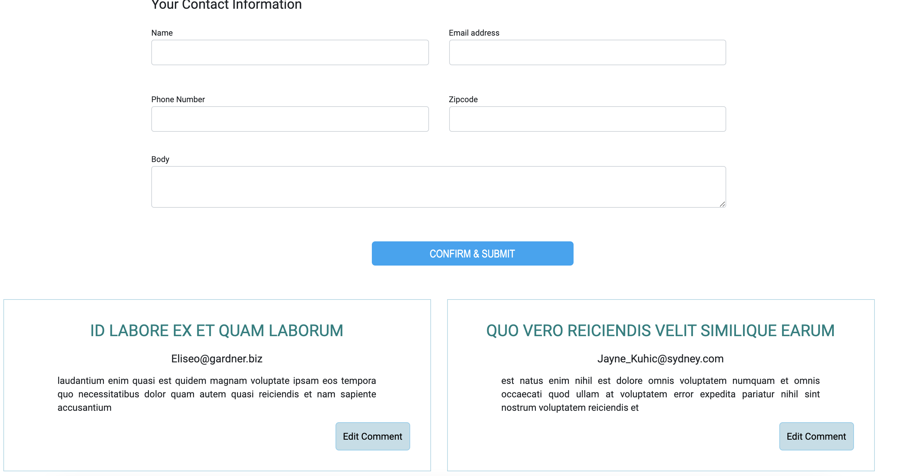
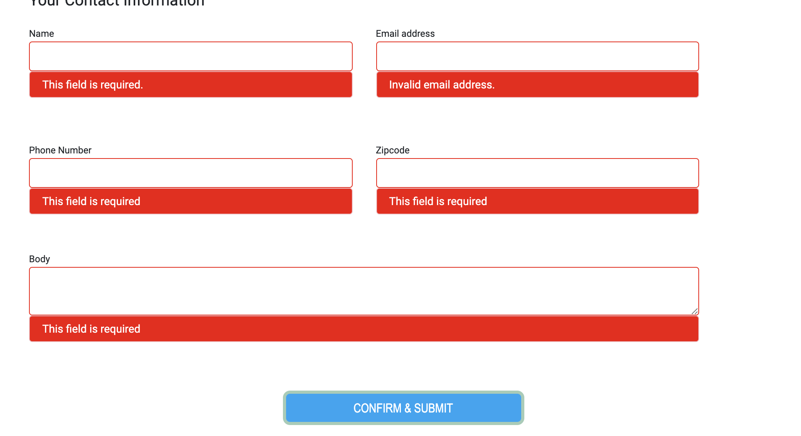
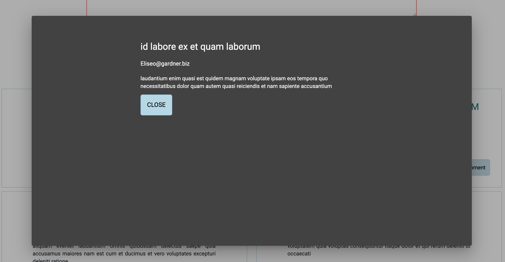

# Angular Front-End Interview

Uses angular 12

Create a project that allows users to view, add, and edit comments. In this project, you will display your Angular, Typescript, CSS, HTML, and UI/UX skills. As a front-end web developer, you should be able to show off your creativity without writing so much code and making things too complicated.

 1. Clone https://github.com/UJAFedNY/angular-front-end-interview.git
 2. Create new angular project called **angular_front-end_interview**
 3. Add **bootstrap** and **angular material** to the project
 4. Create a new folder called **_pages** and store all the upcoming pages into this folder
 5. Create a new page/component called **main**, **comment-form** and, **comment-data**
 6. Main Page
	 1. This page is going to hold comment-form and comment-data pages/components
	 2. On desktop - make columns 6 (comment-data) and 6 (comment-form)
	 3. On Tablet - make columns 12 (top | comment-data) and 12 (bottom | comment-form)
	 4. On Phone - same as tablet
 7. Comment Data Page/Component
	 1. Fetch data from https://jsonplaceholder.typicode.com/comments and show it on the component. (you can use a service to do this)
	 2. Use your creativity to design a comment section by using bootstrap and/or angular material
	 3. Make a clickable edit section and when user clicks this, a Modal/Dialog will open comment form fields already filled in from the API data.
 8. Comment Form Page/Component
	 1. Create a form that accepts **name**, **email**, **phone**, **zip-code**, and **body**
	 2. All fields are required
	 3. Phone field accepts only numbers and has input mask to show number as +1 (888) 888-888
	 4. Email field validates to see if entered string is email
	 5. Zip-Code field can only be 5 digits and only numbers
	 6. If fields are incorrect and/or left empty, make sure there are validation to let user know
	 7. Make sure form matches style of https://www.ujafedny.org/donate
	 8. On Submit, use a fake url to post the values (you can use the service that you made earlier) and show form results in the console. 
	 9. If form is valid, use Angular Material's Snack Bar service to display success message. Otherwise, show error message.
 9. After you are done, make a pull request on Github and let us know that you are done.

# Tips
 - Make sure all pages are lazyloading
 - Make a service folder called **_services** and put all the services inside this one.
 - Form should match the style of our donation section on our live site
 - Zip-Code field should have a directive called numbersOnly that allows only numbers to be entered. You can create a folder called **_directives** and store it there.
 - You can use modal/dialog from Angular Material
 - Make sure you don't commit node_modules folder
